# Clean Thesis Model Notebooks

This directory contains the readable implementations of the final forecasting experiment. The notebooks follow the same data split, window construction, covariates, model settings, and validation procedure as the final cluster jobs, while removing job-submission code and bulk export logic.

The retained experiment asks:

> How closely can conditional generative models forecast household electricity without past household measurements, and how do their context-enabled versions compare with established discriminative baselines?

## Retained Models

The primary generative models each have one notebook:

- `RNN-VAE/RNN-VAE_forecasting.ipynb`: conditional RNN-VAE.
- `Transformer-VAE/Transformer-VAE_forecasting.ipynb`: conditional Transformer-VAE.
- `RNN-Diffusion/RNN-Diffusion_forecasting.ipynb`: conditional RNN-Diffusion.
- `Transformer-Diffusion/Transformer-Diffusion_forecasting.ipynb`: conditional Transformer-Diffusion.

Set `CONTEXT_LEN` in the settings cell:

- `CONTEXT_LEN > 0`: use past kWh and past-observed covariates.
- `CONTEXT_LEN = 0`: omit all historical temporal context.

The discriminative context baselines are:

- `TFT/TFT_context_forecasting.ipynb`
- `N-Hits/N-Hits_context_forecasting.ipynb`
- `TSMixer/TSMixer_context_forecasting.ipynb`
- `iTransform/iTransformer_context_forecasting.ipynb`

TFT, N-HiTS, and TSMixer use Darts. The iTransformer is the local PyTorch implementation used by the final cluster jobs. The Autoregressive Transformer and DoppelGANger directories are outside this retained model set and are intentionally not documented here.

## Environment

The project used Python virtual environments locally and on the Katana cluster. The required environment was installed with:

```powershell
python -m pip install polars numpy pyarrow pandas scikit-learn matplotlib seaborn duckdb "u8darts[torch]" torch==2.9.1 torchvision==0.24.1 torchaudio==2.9.1 --index-url https://download.pytorch.org/whl/cu130 --extra-index-url https://pypi.org/simple
```

CUDA 13.0 wheels require a compatible NVIDIA driver. The notebooks automatically use CUDA when it is available.

## Data Inputs

Each household contains:

- half-hourly kWh readings;
- static numerical household attributes;
- static categorical station and region identifiers;
- observed weather and temperature-lag variables;
- calendar variables derived from each timestamp.

Future model inputs are restricted to calendar values known before prediction: hour, weekday, and month encodings. Temperature, wind, degree-day, and lag variables are used only in the historical branch. This prevents observed future weather from leaking into a forecast.

Place `data_with_weather.pickle` directly in this `sorted` directory. Each model
notebook reads it from the fixed relative path `../data_with_weather.pickle`.
There is no directory search or alternate data-file fallback.

## Window Settings

The settings cell contains an explicit lookup table for every experiment:

| Frequency | 24h target | 7d target | 28d target | 2d context | 7d context |
|---|---:|---:|---:|---:|---:|
| `30min` | 48 | 336 | 1344 | 96 | 336 |
| `1H` | 24 | 168 | 672 | 48 | 168 |
| `2H` | 12 | 84 | 336 | 24 | 84 |
| `3H` | 8 | 56 | 224 | 16 | 56 |

Use a two-day context for the 24-hour experiment and a seven-day context for the 7-day and 28-day experiments. Set the context to zero for the matching no-context generative run. Windows advance by one complete forecast horizon.

## Shared Workflow

Run each notebook from top to bottom:

1. Select the frequency, target length, and context/input length.
2. Load and resample the household data.
3. Derive cyclical calendar features.
4. split unique households into seeded 80% training and 20% validation groups.
5. build windows without crossing household boundaries.
6. fit all scalers on training data only.
7. construct the model inputs and conditioning representation.
8. train and save the checkpoint.
9. forecast the validation windows and print the metric table.

The custom generative models and local iTransformer apply `log1p` before target scaling. The Darts baselines use global MinMax target scaling. Every forecast is returned to kWh before evaluation. Static categorical identifiers are represented with learned embeddings in the custom generative models.

## Loading Checkpoints

Each retained notebook has separate model-definition, training, saving, loading, and evaluation cells. To train a new model, run the data-preparation and model-definition cells, followed by the training and saving cells. To evaluate an existing model, run the data-preparation and model-definition cells, skip training and saving, then select the `.pt` file in the loading cell before running evaluation. The checkpoint path is deliberately kept beside the loading operation so it can be changed without returning to the settings cell.

The loader checks the saved frequency, horizon, window dimensions, feature layout, and target scaling before accepting a checkpoint. Darts checkpoints for TFT, N-HiTS, and TSMixer also require their matching `.pt.ckpt` file to remain beside the selected `.pt` file.

## Model Comparison

The four generative notebooks share the same input interface and conditioning dimensions. This keeps the experiment controlled while varying:

- VAE versus diffusion generation;
- recurrent versus Transformer temporal processing;
- context versus no-context information.

The baseline notebooks return q10, q50, and q90 directly. The generative notebooks extract the same quantiles from 200 sampled trajectories, giving all retained models a common median and 80% prediction interval for evaluation.

## Outputs

Each notebook produces:

- a model checkpoint containing its experiment settings;
- validation forecasts or generated samples;
- a compact table containing MAE, RMSE, Peak MAE, Quantile Loss, KL Divergence,
  DTW, and Winkler Score.

The cleaned notebooks print results instead of recreating the large export trees used by the cluster jobs.

The final experiment artifacts are retained alongside the notebooks:

- `checkpoints/` contains the 96 generative checkpoints and 48 discriminative baseline checkpoints used by the final comparison. Darts checkpoints retain their required paired `.pt` and `.pt.ckpt` files.
- `metrics/Context Forecasting/` contains the 96 context-enabled evaluation runs.
- `metrics/No Context Forecasting/` contains the 48 no-context generative evaluation runs.
- `metrics/` also contains the context and no-context combined workbooks, `forecast_metric_heatmaps_v2_rebuilt.xlsx`, and the profile-band collages.


Because README.md and metrics/ are at the same level, use paths relative to the README:

A clickable image that opens at full resolution uses:
[](metrics/profile_band_collages/image_name.png)
Here is a complete section ready to add near the end of your README:
## Forecast Profile Collages

Each collage compares the real and forecast household profiles across the four sampling frequencies and three forecast horizons. Select an image to open it at full resolution.

### Context-Enabled Generative Models

#### RNN-Diffusion

[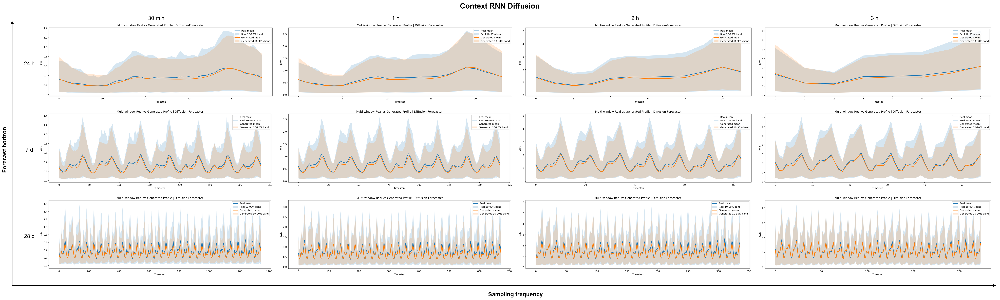](metrics/profile_band_collages/context_rnn_diffusion_profile_bands.png)

#### Transformer-Diffusion

[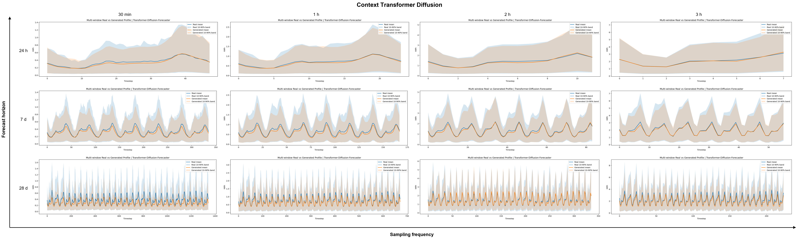](metrics/profile_band_collages/context_transformer_diffusion_profile_bands.png)

#### RNN-VAE

[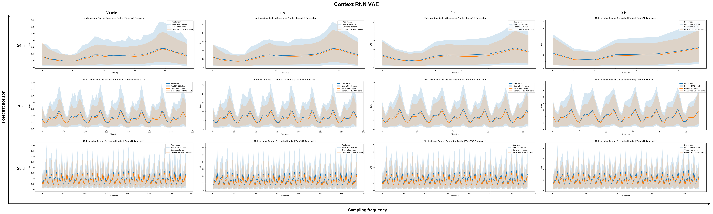](metrics/profile_band_collages/context_rnn_vae_profile_bands.png)

#### Transformer-VAE

[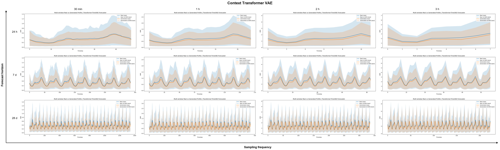](metrics/profile_band_collages/context_transformer_vae_profile_bands.png)

### No-Context Generative Models

#### RNN-Diffusion

[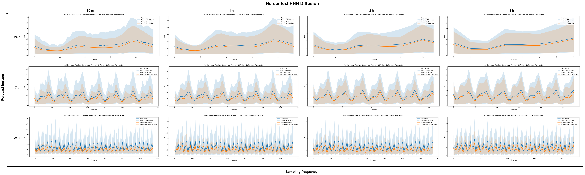](metrics/profile_band_collages/no_context_rnn_diffusion_profile_bands.png)

#### Transformer-Diffusion

[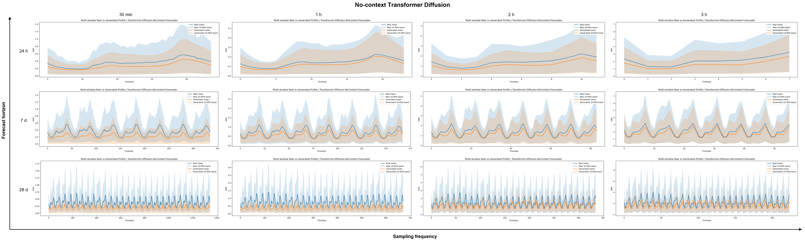](metrics/profile_band_collages/no_context_transformer_diffusion_profile_bands.png)

#### RNN-VAE

[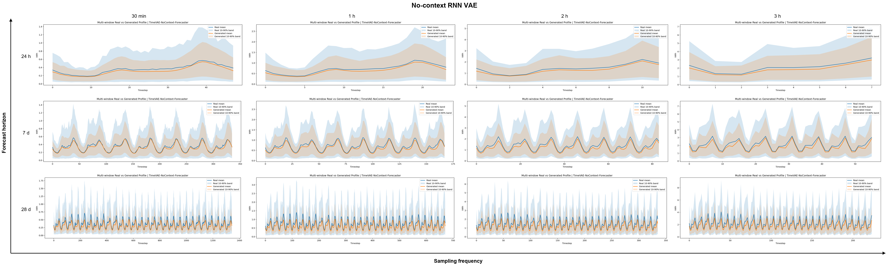](metrics/profile_band_collages/no_context_rnn_vae_profile_bands.png)

#### Transformer-VAE

[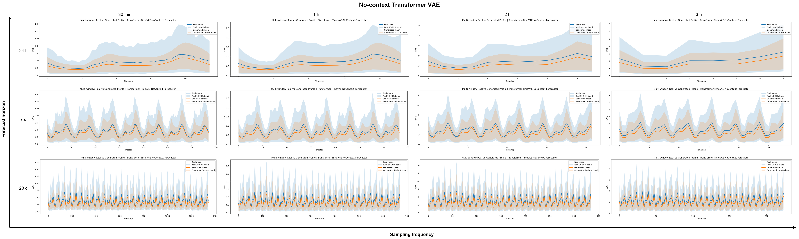](metrics/profile_band_collages/no_context_transformer_vae_profile_bands.png)

### Discriminative Baselines

#### Temporal Fusion Transformer

[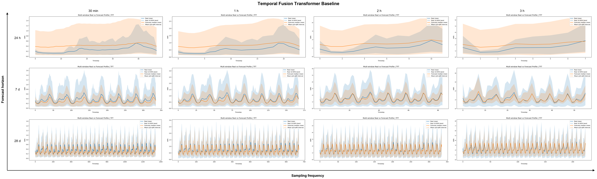](metrics/profile_band_collages/baseline_tft_profile_bands.png)

#### N-HiTS

[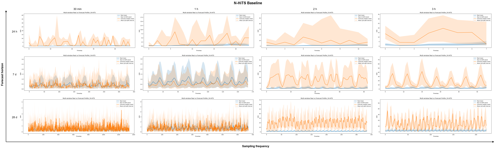](metrics/profile_band_collages/baseline_nhits_profile_bands.png)

#### TSMixer

[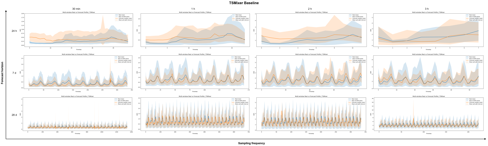](metrics/profile_band_collages/baseline_tsmixer_profile_bands.png)

#### iTransformer

[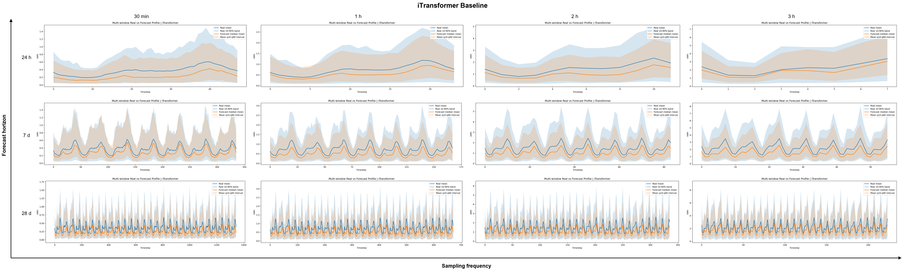](metrics/profile_band_collages/baseline_itransformer_profile_bands.png)